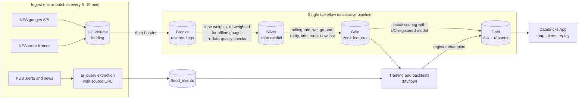

# FloodSense: Earlier, Per-Zone Flash Flood Warnings for Singapore

**DAISI Challenge 2026 · Track B2: Climate Action & Resilience · Round 1 Idea Submission**

> Three slides, in the order the brief asks for. Each slide has its on-slide content first and short speaker notes after. Sources are numbered at the end.

---

## Slide 1: The problem and why it matters

### Flash floods in Singapore are fast, local and hard to see coming

- **17 April 2021:** 161.4 mm of rain fell on western Singapore in three hours (12:25–15:25). That is 91% of April's average monthly rainfall, and in the top 0.5% of daily maxima since 1981. Dunearn Road and Bukit Timah Road flooded near Sime Darby Centre, and the water was gone within about 30 minutes. [1][2]
- **10 January 2025:** Jalan Seaview flooded when heavy rain coincided with a 2.8 m high tide. Rain alone would not have predicted it. [3]
- **Extremes are becoming more common.** 2025 had Singapore's wettest March on record and was its 7th wettest year since 1980. [4]

### PUB's system is strong, but warnings come late

- Flood-prone land is down from about 3,200 ha in the 1970s to under 25 ha today. PUB monitors more than 1,000 water-level sensors and over 500 CCTV cameras, and its radar forecasts rain about 30 minutes ahead. [5][6]
- Public alerts are triggered mainly when the water in a drain rises at a known location. By then, the rain has already fallen.
- No one answers the question residents, drivers and town councils actually have: ***will my area flood in the next hour, how sure are you, and what should I do?***

### Why this is hard to do with ML

Floods are rare: a few dozen recorded events in a decade, across 55 planning areas. A naive model either never raises an alarm or raises so many false ones that people stop listening.

Speaker notes

Open with 17 April 2021: the floods cleared within half an hour, so a warning has to arrive before the rain peaks. PUB's own alerts are triggered by water levels in drains. Jalan Seaview shows why rainfall alone isn't enough. Finish on the rare-event problem, because it shapes every design choice on the next slide.

---

## Slide 2: Solution and data

### FloodSense turns rain forecasts into a per-zone flood risk, with reasons

| Step | What it does | Why it matters |
|---|---|---|
| **1. See the rain** | Maps NEA's 5-minute rain gauges onto each zone, re-weighting automatically when a gauge goes offline. **Radar nowcasting** follows rain cells *before* they reach a zone. | Warns 30–60 minutes earlier and fills the gaps between gauges |
| **2. Know each place** | Per-zone *storm rarity* (how unusual this rain is *here*), a 72-hour wet-ground memory, past flood history, PUB flood-prone locations, and tide for coastal zones | The same rainfall floods some zones and not others |
| **3. Build honest labels** | An LLM extracts each PUB alert or news report into a structured flood event (place, time, severity, cause: rain or rain + tide), **with its source link**. Uncertain extractions go to a human for review. | Real, auditable ground truth that grows over time |
| **4. Model the rare event** | An interpretable logistic regression against LightGBM, both tracked in MLflow. Validation is time-based (train on earlier years, test on later ones), probabilities are calibrated, and the baseline is a simple rainfall-threshold rule. | A risk of 30% should mean a flood about 30% of the time |
| **5. Explain and alert** | A risk map and plain-English alerts, e.g. *"Bukit Timah: HIGH. 1-in-5-year 30-minute burst on ground already wet from yesterday."* | People act on reasons, not bare scores |

**False-alarm budget:** a hard cap on how often "High" can fire without a flood, so people keep trusting the alerts.

### Open data only

| Data | Source | Cadence | Role |
|---|---|---|---|
| Rainfall at each gauge (about 60 stations) | NEA via data.gov.sg real-time API | 5 min | Live input |
| Historical gauge rainfall (2017 onwards) | NEA via data.gov.sg | 5 min | Training, storm-rarity curves, backtests |
| Weather radar images (70 / 240 / 480 km) | NEA via data.gov.sg | 5 min | Nowcasting |
| Planning-area boundaries | URA Master Plan 2019 via data.gov.sg | Static | Zones |
| Tide predictions | Published tide tables | Daily | Coastal zones |
| Flood events | PUB flood alerts (Telegram, press releases) and news | When events occur | Labels, each with a source |

### Prototype status (honest)

**Built and measured on real data:**
- 10 years of NEA 5-minute gauge readings (2017 to Sep 2026, 60.8M readings) interpolated to 55 planning areas. Missing gauges are left out of the interpolation, never treated as zero.
- 66 flood events, each with a source link, a quoted sentence and a human sign-off
- Time-based validation: models are chosen on 2020–23 and scored **once** on 2024–26

**What we found:**

| Held-out test, 2024–26 (30 floods) | Floods caught | Median warning | False alarms per zone-year |
|---|---|---|---|
| Moderate (about 30 mm/h) | 21 (70%) | 15 min | 7.3 |
| High (about 44 mm/h) | 12 (40%) (90% CI 27–53%) | 7.5 min | 1.6 |

- **A transparent rainfall rule beat the ML models.** At matched false-alarm levels, 60-minute rainfall caught 7–15 of 23 validation floods; LightGBM caught 2.
- **Gauges alone give only 10–15 minutes of warning.** The lead time has to come from radar nowcasting, which is next.

Speaker notes

The idea in one sentence: PUB forecasts *rain*, and FloodSense forecasts *flooding for each zone*, explaining why and saying how confident it is. Radar nowcasting provides the lead time, and per-zone knowledge makes it local. Spend the time on steps 3 and 4: sourced labels and honest validation are what stop the rare-event problem from producing a model that only looks good on paper.

---

## Slide 3: Databricks architecture and impact

### One triggered Lakeflow pipeline on serverless compute (Free Edition)

- **Free Edition limits respected:** one pipeline, triggered micro-batches rather than a 24/7 stream, a 2X-Small SQL warehouse, and an app that only reads pre-computed Gold tables.
- **Unity Catalog end to end:** data, features, the flood-event table and the registered model. MLflow holds every experiment and backtest.
- **Backtesting harness:** every past storm is replayed through the full pipeline before any model change goes live.

### Live demo: replay the 17 April 2021 storm

The demo steps through the real 5-minute gauge readings from that afternoon, zone by zone. Bukit Timah reaches Moderate at 12:29 and High at 12:45, about an hour before Dunearn Road was reported flooded (1:44 pm). The earlier, synthetic-trained model peaked at 6.7% and never raised an alert. The same storm also put 22 zones on High, and most of them have no matching flood report, which is the false-alarm cost in miniature.

### Impact: a complement to PUB, not a replacement

| Who | What they get |
|---|---|
| **Residents and drivers** | Earlier, per-zone warnings with a reason, including coverage where PUB has no sensors |
| **Town councils** | Which zones' drains to clear first before a storm arrives |
| **Planners** | Zones becoming more fragile over the years, to inform drainage spending |

**How we'll measure success:**
- Minutes of warning before PUB's own alert
- The share of held-out flood events caught
- A false-alarm ratio kept within budget

Speaker notes

Everything fits in Free Edition: one pipeline, triggered rather than continuous. The replay demo makes the case without needing it to rain on the day. Close on positioning: FloodSense adds lead time, local detail and explanations on top of PUB's network, and it is measured against PUB's own alerts.

---

### Sources

1. Mothership, "161.4mm of rain over western S'pore in 3 hours…", 17 Apr 2021 (quoting PUB). https://mothership.sg/2021/04/singapore-floods-april-17/
2. FloodList, "Singapore – Flash Floods After Heavy Rain", Apr 2021. https://floodlist.com/asia/singapore-flash-floods-april-2021
3. Mothership, "More rain from Jan. 10–11 than average monthly rainfall for the month: PUB", Jan 2025. https://mothership.sg/2025/01/more-rain-january/
4. Meteorological Service Singapore, "Singapore records wettest ever March and hottest ever June and November in 2025". https://www.weather.gov.sg/singapore-records-wettest-ever-march-and-hottest-ever-june-and-november-in-2025/
5. Ministry of Sustainability and the Environment, oral reply to PQ on drainage improvement, 4 Feb 2025. https://www.mse.gov.sg/latest-news/oral-reply-on-drainage-improvement-feb2025/
6. PUB, "Flood Forecasting and Monitoring". https://www.pub.gov.sg/Public/KeyInitiatives/Flood-Resilience/Flood-Forecasting-and-Monitoring
7. data.gov.sg, real-time rainfall API and weather radar images dataset. https://data.gov.sg/
