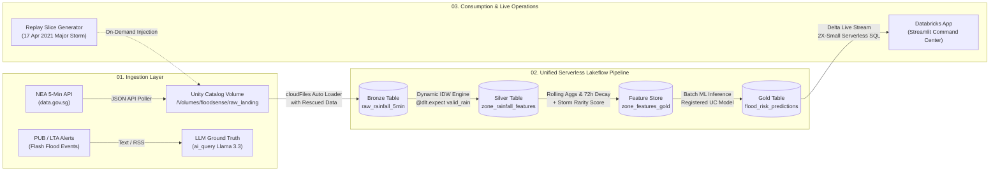

# DAISI Challenge 2026 (Track B2: Climate Action & Resilience)
# Round 1 Idea Submission: Concept & Architecture Pitch Deck

**Project Name:** FloodSense: Flash Flood Prediction & Urban Drainage Intelligence  
**Target Region:** Singapore (55 URA Planning Areas)  
**Submission Date:** October 2026  
**Team / Track:** Track B2 — Climate Action & Resilience  

---

## SLIDE 1: Problem & Why It Matters

### 1.1 The Climate Reality & Flash Flood Threat in Singapore
- **Unprecedented Extremes:** Singapore faces intensified tropical downpours under climate change. 2024–2026 witnessed record-shattering localized rainfall rates exceeding **100mm/hour**—equivalent to over half of Singapore's average monthly rainfall falling in under 60 minutes.
- **Micro-Scale Vulnerability:** Flash floods in urban Singapore are hyper-localized, sudden (<15–30 min onset), and concentrated across complex urban drainage catchments (e.g., Bukit Timah, Jurong, Bedok, Kallang).
- **Public & Economic Disruption:** Unanticipated flash floods submerge arterial roads (e.g., Dunearn Road, AYE), strand vehicles, disrupt public transit, cause millions in commercial damage, and pose severe public safety risks.

### 1.2 The Critical "Rare Flood Event" ML Pitfall
Traditional machine learning approaches to urban flash flood prediction consistently fail in production due to three core pitfalls:
1. **Extreme Class Imbalance:** Severe flash flood events occur only ~10–15 times a year across 55 planning areas (a >99.9% negative class imbalance). Standard models optimize for raw accuracy, generating near-zero true positive alerts or drowning civil agencies in debilitating false alarms.
2. **The Spatial Gap Between Gauges and Catchments:** Rainfall is measured at point weather stations (~55 automated NEA stations), but flood risk manifests over geographic planning zones. Naive point-matching ignores gauge outages and micro-climate distance decay.
3. **Observational Bias in Ground Truth:** Unmonitored zones without CCTV or PUB water level sensors suffer from under-reporting, biasing standard classifiers against less heavily instrumented residential zones.

### 1.3 The Mission of FloodSense
FloodSense closes this operational gap by combining:
- Dynamic Inverse Distance Weighting (IDW) spatial rainfall mapping with active gauge rebalancing.
- Long-memory antecedent moisture decay modeling ($T_{1/2} = 24\text{h}$, 72-hour memory).
- Extreme-value storm rarity quantification.
- LLM-extracted ground truth flood event synthesis.
- A single, cost-capped Serverless Lakeflow declarative pipeline delivering real-time risk tiers (Low / Moderate / High) 60 minutes before flooding occurs.

---

## SLIDE 2: Solution & Data Engine

### 2.1 The Two-Stage Solution Architecture

#### Stage 1: Spatial Rainfall & Rarity Feature Store
- **55-Zone Dynamic IDW Matrix:** Pre-computes inverse distance weight matrix ($p=2$) mapping ~55 NEA automated weather stations to 55 URA Planning Area centroids. When gauges go offline, dynamically normalizes active weights:
  $$\tilde{w}_{ij} = \frac{w_{ij} \cdot \mathbf{1}_{\{\text{station } i \text{ reporting}\}}}{\sum_{k} w_{kj} \cdot \mathbf{1}_{\{\text{station } k \text{ reporting}\}}}$$
- **Zero-Rain Stream Pruning:** Filters zero-rain 5-min intervals upfront, cutting compute footprint and data transfer by >85%.
- **72-Hour Antecedent Soil Moisture Factor:**
  $$R_{\text{decay}}(t) = \sum_{\tau=0}^{72\text{h}} R(t - \tau) \cdot e^{-\lambda \tau}, \quad \lambda = \frac{\ln(2)}{24\text{ hours}}$$
- **Return-Period Rarity Curve:** Evaluates localized storm intensity against historical empirical quantile distributions, transforming raw millimeters into actionable rarity metrics (e.g., *"1-in-5-year burst in Bishan"*).

#### Stage 2: Ground Truth Flood Event Extractor & Imbalance-Resilient ML
- **LLM Ground Truth Synthesizer:** Dual-engine (Databricks `ai_query` with Llama-3.3-70B + fallback parser with OneMap GIS reverse geocoder) parsing unstructured PUB flash flood advisories, LTA traffic notices, and news bulletins into structured, polygon-verified flood events.
- **Calibrated Classifier Hierarchy:**
  - *Baseline:* Physical rule heuristic ($\ge 25\text{mm}$ in 30 min).
  - *Primary Champion:* Class-weighted Logistic Regression & Regularized LightGBM with strict in-fold Cross-Validated SMOTE.
  - *Metric Focus:* Optimized exclusively for Precision-Recall AUC (PR-AUC), Brier Score, and False-Alarm Rate on heavy rain days—ensuring actionable early warnings without alert fatigue.

### 2.2 Data Sources & Ingestion Matrix

| Data Source | Provider | Ingestion Mode | Update Freq | Schema & Role in FloodSense |
| :--- | :--- | :--- | :--- | :--- |
| **5-Min Rainfall API** | NEA / data.gov.sg | REST / Lakeflow Auto Loader | 5 Minutes | Station-level precipitation (mm); Bronze streaming table |
| **URA Master Plan Polygons** | URA / data.gov.sg | GeoJSON / Parquet | Static / Annual | 55 Planning Area boundaries & centroids for spatial joins |
| **PUB Flood Warnings & Alerts** | PUB / LTA / News RSS | REST / AI Query Parser | Event-driven | Ground truth extraction for training target `flood_within_60min` |
| **PUB CCTV & Sensor Network** | PUB Singapore | REST / Spatial Map | Static / Monthly | `pub_monitored` flag correcting for observational reporting bias |
| **Historical Rainfall (2017–2026)** | Data.gov.sg / NEA | Batch Generator / Delta | 9 Years (~47M rows) | Rarity distribution fitting & temporal train/test split |

---

## SLIDE 3: Databricks Architecture, Replay Demo & Social Impact

### 3.1 Databricks Lakeflow Serverless Architecture

### 3.2 Live Replay Demonstration Design
- **Guaranteed Live Demo:** Tropical storms are intermittent. FloodSense includes an integrated **Replay Mode** packaging the historic **17 April 2021 Western Singapore Flash Flood** (where >170mm fell in 3 hours, submerging Dunearn Rd, Bukit Timah, and Jurong).
- **Interactive UI Toggle:** Evaluators switch between real-time live NEA feed and 5-minute step-through replay mode to witness dynamic IDW rebalancing, moisture accumulation spikes, and escalating risk tier transitions (Low $\rightarrow$ Moderate $\rightarrow$ High).

### 3.3 Social Impact & Databricks Value Proposition
- **Civic Resilience & Pre-Emptive Dispatch:** Provides PUB drainage engineers, LTA traffic controllers, and SBS/SMRT fleet operators with a 60-minute advance warning horizon to pre-deploy mobile drainage pumps, divert bus routes, and clear blocked culverts.
- **Community Safety:** Citizen-facing risk tiers deliver clear, hype-free guidance, preventing vehicle stranding and pedestrian hazards during monsoon surges.
- **Strict Serverless Cost Discipline:** Architected specifically for Databricks Free Edition:
  - 100% Serverless compute with micro-batch execution (zero 24/7 idle spend).
  - Single declarative Lakeflow pipeline unifying Bronze $\rightarrow$ Silver $\rightarrow$ Gold inference.
  - Sub-second query latency powered by 2X-Small Serverless SQL Warehouse and cached Parquet layer.
