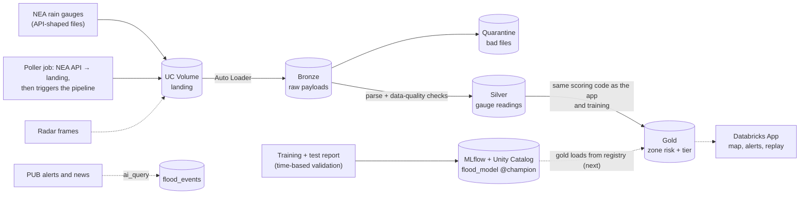

# FloodSense: Earlier, Per-Zone Flash Flood Warnings for Singapore

**DAISI Challenge 2026 · Track B2: Climate Action & Resilience · Round 1 Idea Submission**
Due **Tue 6 Oct 2026, 23:59 SGT**: a 3-slide PDF (problem / solution and data / Databricks architecture and impact).

> This is the content brief for the slides. Each slide has a headline, the short on-slide text, the
> visuals with their exact data, and speaker notes. Every number was checked on 2 Oct 2026 against
> `models/final_report.json`, the 17 Apr 2021 replay, `data/reference/flood_events.csv` and
> `DEPLOYMENT.md`. Sources are numbered at the end. Keep each slide to one headline, about three short
> blocks and one main visual.

---

## Slide 1: The problem and why it matters

**Headline:** Flash floods in Singapore are fast, local, and the warning comes late.

**On the slide:**
- **17 April 2021:** 161.4 mm of rain fell on western Singapore in three hours (12:25–15:25),
  91% of April's average monthly rainfall. Dunearn Road flooded, and the water was gone within about
  30 minutes. [1][2]
- **PUB's system is strong:** flood-prone land is down from about 3,200 ha in the 1970s to under 25 ha.
  More than 1,000 water-level sensors, over 500 CCTV cameras, and radar that forecasts rain about
  30 minutes ahead. [5][6]
- **But warnings are broad or late:** public flood alerts are mostly regional, or fire when water in
  a drain rises, after the rain has fallen. Few say *which* zone and *how likely*:
  ***will my area flood in the next hour?*** [6]
- **Why ML struggles:** floods are rare. We found 66 sourced floods in ten years, in 27 of 55 planning
  areas. A naive model either never alarms or alarms so often that people stop listening.

**Visual: bar chart, "Recorded flash floods per year (sourced)"**

| 2017 | 2018 | 2019 | 2020 | 2021 | 2022 | 2023 | 2024 | 2025 | 2026 (to Sep) |
|---|---|---|---|---|---|---|---|---|---|
| 1 | 8 | 4 | 8 | 9 | 4 | 2 | 8 | 15 | 7 |

Optional callout: 2025 had Singapore's wettest March on record. [4]

Speaker notes

Open with 17 April 2021. The water cleared in half an hour, so a warning is only useful if it arrives
before the rain peaks. PUB's alerts are triggered by water levels in drains, which is late for a
flash flood. Close on rarity, because it shapes every design choice on the next slide. The counts
are floods we could source with a link and a quote, not every flood that happened.

---

## Slide 2: Solution and data

**Headline:** FloodSense turns rain into a per-zone flood risk, with the reason.

**Visual 1: five-step flow** (icons and arrows; tag built steps and "next" steps differently)

| Step | Built | Next |
|---|---|---|
| **1. See the rain** | NEA's 5-minute gauges mapped to each of 55 zones, re-weighted when a gauge goes offline (never treated as dry) | Radar nowcasting, to see rain cells before they arrive |
| **2. Know each place** | Rain measured per zone, so each zone gets its own risk (the alert threshold is shared across zones); *storm rarity* (how unusual this rain is in this zone) shown as the reason | Zone susceptibility (which zones flood more), tide for coastal zones (Jalan Seaview flooded on 10 Jan 2025 when heavy rain met a 2.8 m high tide [3]); terrain and paved area |
| **3. Honest labels** | 66 flood events, each with a source link, a quoted sentence and a human sign-off | More events as alerts come in |
| **4. Model the rare event** | Rules, logistic regression and LightGBM compete at equal false-alarm levels; time-based validation; calibrated probabilities | Retrain as labels grow |
| **5. Explain and alert** | A risk map and plain reasons, e.g. *"Bukit Timah: HIGH. 47 mm in the last hour, at the top of this zone's 2017–2023 record"* (the real 12:45 reading on 17 April 2021) | Push alerts |

**Data strip (all open data):**
- NEA 5-minute rain gauges via data.gov.sg, 2017 to Sep 2026: **60.8 million readings** [7]
- URA Master Plan 2019 planning-area boundaries (55 zones)
- **66 flood events** from PUB alerts and news, each sourced and signed off
- Next: rain-area radar frames (no public archive, so we archive from now on) [8], tide tables

**Visual 2 (main chart): "With only 36 floods to learn from, the simplest model was the most robust"**
Floods caught (of 23, validation years 2020–2023) at the same false-alarm level. Grouped bars or lines;
x = false alarms per zone per year.

| Model | 1 | 2 | 5 | 10 |
|---|---|---|---|---|
| **60-minute rainfall rule (chosen)** | **7** | **8** | **15** | **15** |
| 30-minute rainfall rule | 5 | 7 | 13 | 17 |
| Logistic regression | 1 | 4 | 4 | 5 |
| LightGBM | 2 | 2 | 2 | 2 |

Caption: "With this few floods, ML overfit. We ship the most robust model and say so. AI next: radar
nowcasting, LLM-drafted flood events with human sign-off, and one model that shares strength across zones."

**Results box: held-out test, 2024 to Sep 2026 (30 floods), scored once**

| Alert level | Floods caught | Median warning | False alarms per zone-year |
|---|---|---|---|
| Moderate (from 0.30% chance) | 21 of 30 (70%) | 15 min | 7.3 |
| High (from 0.71% chance) | 12 of 30 (40%; 90% CI 27–53%) | 10 min | 1.6 |

- **Precision, honestly:** about 1 in 16 High alerts was followed by a *reported* flood. Reported floods
  undercount real ones, so some "false" alarms are floods nobody wrote about.
- **Ranking:** in 16 of the 30 test floods, the flooded zone was among our 5 riskiest of 55.
- Median warning counts floods with a reported time; the 3 date-only reports count as hits or misses but carry no warning time.
- **Honest limit:** rain gauges alone give 10–15 minutes of warning. Radar nowcasting is how we get more.

Speaker notes

One sentence: PUB forecasts rain; FloodSense forecasts flooding for each zone and says why. Spend the
time on labels and validation. Every flood is sourced, the test years were scored once, and the
simplest model won. That's why the numbers can be trusted. The alert levels look small (0.30% and
0.71%) because a reported flood in a given zone and hour is rare. They were set from false-alarm
budgets the team chose before seeing the test set.

---

## Slide 3: Databricks architecture and impact

**Headline:** One triggered Lakeflow pipeline on Databricks Free Edition, already running.

**Visual 1: architecture diagram.** Draw what ran with solid lines, and what's next with dashed lines.

Poller fact (6 Oct 2026): the Databricks job `floodsense-rainfall-poller` fetched the last 96 h of
live NEA readings and triggered the pipeline. Gold now holds live risk for all 55 zones up to
16:40 SGT on 6 Oct (15,840 rows), with 0 quarantined files. The job has a 30-minute schedule,
paused to stay inside Free Edition's daily compute; it is run on demand until Demo Day.

Registry fact (6 Oct 2026): `workspace.floodsense.flood_model` version 1, alias `champion`, logged with
its model card, test report and test metrics. Loaded back from the registry, it scores the 17 Apr
2021 replay identically to the pipeline's model (4,675 rows, max difference 0). Gold still loads the
committed model file, so the registry → gold arrow stays dashed.

**Proof strip:** "Ran on Databricks Free Edition on 2 Oct 2026. 949 files → 64,223 gauge readings
→ 15,840 zone-risk rows in about 1¾ minutes. Every row's risk tier matched our local scoring."
Add a **screenshot of the pipeline graph** with row counts (update `34cfa680…`).

**Visual 2: "17 April 2021, Bukit Timah".** A line chart of 60-minute rain (mm) with three markers.

| 12:00 | 12:15 | 12:30 | 12:45 | 13:00 | 13:15 | 13:30 | 13:45 | 14:00 | 14:15 |
|---|---|---|---|---|---|---|---|---|---|
| 3.8 | 20.9 | 34.5 | 46.6 | 54.2 | 47.1 | 41.6 | 36.8 | 31.0 | 24.2 |

Markers:
- **Moderate at 12:25**
- **High at 12:45**
- **Dunearn Road flood reported at about 13:44**

Caption: "Best case on record: High about an hour before the report. The typical warning is about
10 minutes; radar nowcasting is how we extend it."

**Impact: a complement to PUB, not a replacement**

| Who | What they get |
|---|---|
| Residents and drivers | Earlier, per-zone warnings with a reason, including where PUB has no sensors |
| Town councils | Which zones' drains to clear first before a storm |
| Planners | Zones becoming more flood-prone over the years, to guide drainage spending |

**How we'll measure success:**
- minutes of warning before PUB's own alert
- share of floods caught
- false alarms kept within budget

**Free Edition limits respected:**
- one pipeline
- triggered runs, not a 24/7 stream
- small serverless compute

Speaker notes

The architecture isn't a plan on paper. The pipeline ran on Free Edition and reproduced our local
results row for row. The model's code runs inside the pipeline unchanged, so the app, training and
Databricks can't drift apart. The 17 April chart shows the idea: High about an hour before the
report. But be straight about the cost. 24 zones went High at some point that afternoon (at most 11
at once), and most had no flood report. Across all test floods the median warning is 10–15 minutes,
which is why radar is next.

Don't claim any of these; none is built yet:
- that the app reads from Databricks
- that gold or the app loads the model from the registry (it's registered, not served from there yet)
- that `ai_query`, radar or tide are in use
- that every storm is replayed before each model change

They are the dashed parts of the diagram.

---

### Sources

1. Mothership, "161.4mm of rain over western S'pore in 3 hours…", 17 Apr 2021 (quoting PUB). https://mothership.sg/2021/04/singapore-floods-april-17/
2. FloodList, "Singapore – Flash Floods After Heavy Rain", Apr 2021. https://floodlist.com/asia/singapore-flash-floods-april-2021
3. Mothership, "More rain from Jan. 10–11 than average monthly rainfall for the month: PUB", Jan 2025. https://mothership.sg/2025/01/more-rain-january/
4. Meteorological Service Singapore, "Singapore records wettest ever March and hottest ever June and November in 2025". https://www.weather.gov.sg/singapore-records-wettest-ever-march-and-hottest-ever-june-and-november-in-2025/
5. Ministry of Sustainability and the Environment, oral reply to PQ on drainage improvement, 4 Feb 2025. https://www.mse.gov.sg/latest-news/oral-reply-on-drainage-improvement-feb2025/
6. PUB, "Flood Forecasting and Monitoring". https://www.pub.gov.sg/Public/KeyInitiatives/Flood-Resilience/Flood-Forecasting-and-Monitoring
7. data.gov.sg, real-time rainfall API and "Historical Rainfall across Singapore" (NEA). https://data.gov.sg/
8. Meteorological Service Singapore, "Rain Areas" radar imagery. https://www.weather.gov.sg/weather-rain-area-50km/
